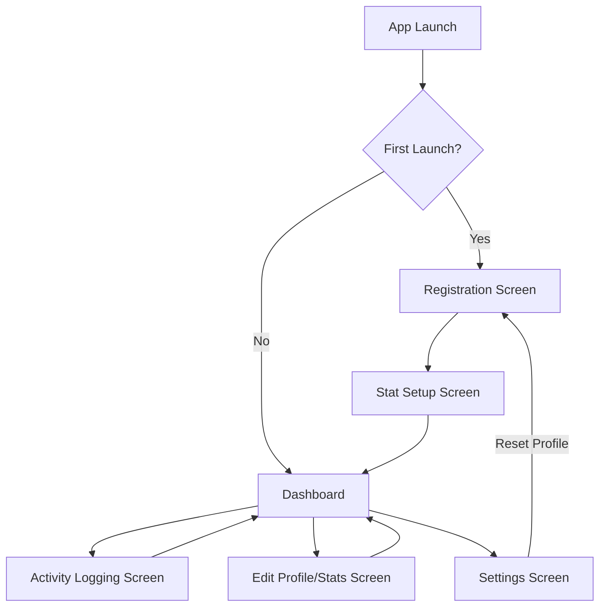

# Solo Leveling Life Tracker Mobile App(Name: YOLO Leveling): Detailed Specification

## Overview
This document provides a comprehensive overview of the "Solo Leveling Life Tracker" mobile app, a personal gamification tool inspired by the webtoon/manhwa *Solo Leveling*. The app turns self-improvement into an RPG-like experience, where users track daily activities to level up stats, gain EXP, and progress as a "character." It's designed for cross-platform use (iOS and Android) and starts as a minimal viable product (MVP) based on the user's personal needs, but with an architecture that allows easy expansion to a "full version" with advanced features.

The app is offline-first, persistent, and user-friendly for daily use. No user accounts or cloud services are required in the MVP, but placeholders should be included for future additions. The goal is to motivate users (starting with the owner) to quit bad habits, build routines, and enjoy life through gradual progress tracking.

**Target Audience**: Initially personal (one user), but designed to scale if popular (e.g., add sharing or community features later).

**Tech Stack Recommendation**: Flutter (Dart) for cross-platform development. Reasons: Single codebase, rich UI widgets, good for state management, and extensible. Alternatives (if intern prefers): React Native.

**Key Principles**:
- **Modularity**: Build with clean architecture (e.g., MVVM) so features like quests or notifications can be added without rewriting core code.
- **Offline & Persistent**: All data local (e.g., Hive or SQLite database).
- **User-Friendly**: Simple, intuitive UI with game-like visuals (progress bars, alerts).
- **Extensibility**: Comment placeholders for future features; use interfaces/abstract classes for services.

## Core Features (MVP)
The MVP focuses on the basics from the user's requirements: onboarding-based starting stats, activity logging, stat/EXP updates, leveling, and limited degradation. All features must be implemented with future-proofing in mind.

### 1. Onboarding & Initial Setup
- **What it Does**: On first launch, guide the user through a simple "registration" (local-only) and stat setup. User can manually enter initial stat values or default to 0. This sets up the character baseline before accessing the dashboard.
- **Details**:
  - **Registration Step**: Basic form for a username (e.g., "MyCharacter") and optional email (stored locally; no real auth or validation in MVP). This creates a local "profile" in storage.
  - **Stat Setup**: After registration, show a form with the 6 stats (Strength, Agility, Vitality, Intelligence, Wisdom, Charisma). Each is a number input (float, default 0.0, range 0-10 suggested). User can edit and save, or skip to use defaults (all 0.0).
  - Starting Level: 1, EXP: 0 (auto-set after stats).
  - If app relaunched: Skip onboarding if profile exists; option in settings to "Reset Profile" (clears data, restarts onboarding).
- **UI**: Multi-step screen (e.g., Step 1: Registration form with TextFields and "Next" button; Step 2: Stat form with ListView of inputs and "Save & Start" button). Use tooltips or labels like "Enter your starting Strength (e.g., based on self-assessment)".
- **Future Extensibility**: 
  - Replace manual entry with a questionnaire form (e.g., 5-10 questions per stat), then process responses via an LLM backend (e.g., API call to an AI service like Grok to generate stats: "Analyze these answers and output balanced starting stats 1-10"). 
  - Add real registration (e.g., email/password with Firebase Auth) in a separate AuthService module.
  - Placeholder: Comment in code like "// Future: Integrate OnboardingService with LLM for auto-stat generation".

### 2. Dashboard (Home Screen)
- **What it Does**: Central hub showing current progress. Auto-applies degradation on app open if applicable.
- **Details**:
  - Display: Level (e.g., "Level 1"), EXP progress bar (current EXP / next threshold), list of stats with values (e.g., "Strength: 3.4" with a progress-like bar for visualization).
  - Log History: Scrollable list of recent logs (e.g., "2025-07-17: Workout - Weightlifting for 60 mins").
  - Buttons: "Log Activity" → navigates to Log Screen; "Edit Profile/Stats" (links back to stat form for adjustments).
- **UI**: Material Design with dark theme (Solo Leveling vibe—blacks, reds). Use ListView for stats/logs, LinearProgressIndicator for EXP.
- **Future Extensibility**: Add tabs for "Character Sheet," "Inventory," or "Quests."

### 3. Activity Logging
- **What it Does**: Users select an activity, enter duration (minutes), and submit to update stats/EXP/logs.
- **Details**:
  - Activities (configurable Map, e.g., in constants.dart):
    - Workout - Weightlifting: +0.1 Strength, +0.05 Vitality per 60 mins; 20 EXP/hour; group: 'workout'.
    - Workout - Cardio: +0.1 Agility, +0.05 Vitality; 20 EXP; group: 'workout'.
    - Workout - Yoga: +0.1 Agility, +0.05 Wisdom; 20 EXP; group: 'workout'.
    - Study - Serious: +0.1 Intelligence; 15 EXP; group: 'study'.
    - Study - Casual: +0.05 Intelligence, +0.05 Wisdom; 15 EXP; group: 'study'.
    - Meditation: +0.1 Wisdom; 15 EXP; group: none.
    - Resistance Session (Quit Bad Habit): +0.1 Wisdom; 15 EXP; group: none.
  - Calculation: Increment = (duration / 60) * base_increment; EXP = (duration / 60) * base_EXP. Stats floor at 0.
  - Logging: Save timestamp, activity, duration as a log entry. Reset degradation streak for the activity's group.
- **UI**: Dropdown for activity selection, Number input/slider for minutes (min 1, suggested 60+), Submit button. Validation: Prevent empty/invalid inputs.
- **Future Extensibility**: Add custom activity creation (e.g., form to define new ones with stat mappings). Integrate with "quests" (e.g., auto-complete daily quests).

### 4. Leveling System
- **What it Does**: Accumulate EXP to level up. Thresholds are exponential and challenging.
- **Details**:
  - EXP Gain: As above, per activity.
  - Thresholds: Level 1→2: 500 EXP; then multiply by 2.5 each time (e.g., 1250, 3125, etc.). Accumulate total EXP; subtract on level up.
  - On Level Up: No perks in MVP, but show alert and update dashboard.
- **Future Extensibility**: Unlock "perks" (e.g., multipliers), new quests, or rewards screen.

### 5. Skill Degradation
- **What it Does**: Penalize inactivity for specific groups to encourage consistency.
- **Details**:
  - Applies only to 'workout' (degrades Strength/Agility) and 'study' (degrades Intelligence).
  - On app load: For each group, calculate days since last relevant log. If >0, decrement = base (-0.01) + (-0.005 per missed day), capped at -0.05 per day. Apply total (days * daily_dec) to stats.
  - Track last dates and streaks per group. Reset on logging.
  - No EXP/level degradation.
- **Future Extensibility**: Expand to all stats/groups; add config toggle; integrate with "HP" system (deplete health for penalties).

### 6. Data Persistence & Offline Support
- **What it Does**: Save all state (profile, stats, EXP, level, logs, last dates, streaks) locally. Load on start.
- **Details**: Use Hive or SQLite for structured storage. Auto-save after logs/level ups/onboarding. Backup/export to JSON/CSV button.
- **Future Extensibility**: Add cloud sync (e.g., Firebase) via a separate service layer.

## Non-Functional Requirements
- **Performance**: Lightweight; quick loads even with 1000+ logs.
- **Security**: Local data only; no sensitive info.
- **Accessibility**: High contrast, large text/buttons.
- **Testing**: Unit tests for calculations (e.g., increments, degradation); integration tests for UI flows.
- **Error Handling**: Graceful (e.g., alerts for invalid inputs; fallback to defaults on corrupt data).
- **Platform Support**: Android/iOS; test on emulators.
- **App Size**: Keep under 50MB.

## Future Features (Placeholders for Expansion)
Design the app so these can be added modularly (e.g., new services/screens without core changes):
- **Quests System**: Daily/main/side quests with XP rewards (add QuestService).
- **Boss Battles & Penalties**: Tough challenges; HP system for failures.
- **Inventory/Rewards**: Earn virtual items; real-world reward reminders.
- **Streaks & Multipliers**: Bonuses for consecutive days.
- **Social/Sharing**: Export progress; multiplayer "parties."
- **Notifications**: Daily reminders (via local scheduler).
- **Visuals/Narrative**: Character avatar, story journal, charts/graphs.
- **Customizations**: Add/edit stats/activities; themes.
- **Analytics**: Track usage for motivation (local only).
- **Monetization/Sharing**: If popular, add accounts, API, premium features.
- **Advanced Onboarding**: Replace manual stat entry with LLM processing (e.g., send questionnaire answers to backend AI for stat generation).

## Development Guidelines
- **Architecture**: MVVM (Model: data classes; View: widgets; ViewModel: logic/providers).
- **State Management**: Provider or Riverpod for reactive updates.
- **Code Style**: Clean, commented; use constants for configs.
- **Version Control**: Git; branches for features.
- **Dependencies**: Minimal (e.g., provider, intl for dates, hive for storage).
- **Build Process**: Flutter build for APK/IPA.

## Task Plan Template for Intern
Once the intern reviews this, they should generate:
1. **Requirements Refinement**: List functional/non-functional in user stories (e.g., "As a user, I can register locally and set initial stats to customize my starting point").
2. **Design**: Wireframes (e.g., via Figma); class diagrams for architecture.
3. **Task Plan**: Break into sprints (e.g., Week 1: Setup, Onboarding & Data Layer; Week 2: UI & Logic; Week 3: Testing & Polish). Estimate time, assign subtasks.


# Design Document: YOLO Leveling App

## Overview

The YOLO Leveling app is a gamified self-improvement tracker inspired by the Solo Leveling webtoon/manhwa. It transforms daily activities into an RPG-like experience where users can level up their character stats through real-world activities. This document outlines the technical design and architecture for implementing the app as specified in the requirements.

The app will be built using Flutter for cross-platform compatibility (iOS/Android), with an offline-first approach using Hive for local data persistence. The design follows MVVM architecture to ensure modularity and extensibility for future features.

## Architecture

### High-Level Architecture

The app will follow the MVVM (Model-View-ViewModel) architecture pattern with the following layers:

```
┌─────────────────┐     ┌─────────────────┐     ┌─────────────────┐     ┌─────────────────┐
│                 │     │                 │     │                 │     │                 │
│      Views      │◄────┤   ViewModels    │◄────┤    Services     │◄────┤    Models       │
│   (UI Widgets)  │     │  (State Logic)  │     │ (Business Logic)│     │  (Data Classes) │
│                 │     │                 │     │                 │     │                 │
└─────────────────┘     └─────────────────┘     └─────────────────┘     └─────────────────┘
                                                        │
                                                        ▼
                                               ┌─────────────────┐
                                               │                 │
                                               │  Repositories   │
                                               │ (Data Access)   │
                                               │                 │
                                               └─────────────────┘
                                                        │
                                                        ▼
                                               ┌─────────────────┐
                                               │                 │
                                               │  Local Storage  │
                                               │     (Hive)      │
                                               │                 │
                                               └─────────────────┘
```

### Key Components

1. **Views**: Flutter widgets that render the UI and handle user interactions
2. **ViewModels**: Manage UI state and business logic, using Provider for state management
3. **Services**: Handle core business logic like stat calculations, leveling, and degradation
4. **Repositories**: Abstract data access operations
5. **Models**: Define data structures for the application
6. **Local Storage**: Hive database for persistent storage

### Dependency Injection

We'll use a simple service locator pattern for dependency injection to maintain loose coupling between components. This will make it easier to replace implementations and add new features in the future.

```dart
// Example service locator
class ServiceLocator {
  static final ServiceLocator _instance = ServiceLocator._internal();
  factory ServiceLocator() => _instance;
  ServiceLocator._internal();
  
  final Map<Type, dynamic> _services = {};
  
  void register<T>(T service) {
    _services[T] = service;
  }
  
  T get<T>() {
    return _services[T] as T;
  }
}
```

### State Management

The app will use Provider for reactive state management through ViewModels. This will ensure UI components automatically update when the underlying data changes.

```dart
// Example provider setup
void main() {
  runApp(
    MultiProvider(
      providers: [
        ChangeNotifierProvider(create: (_) => OnboardingViewModel(serviceLocator.get())),
        ChangeNotifierProvider(create: (_) => DashboardViewModel(
          serviceLocator.get(), 
          serviceLocator.get(),
          serviceLocator.get(),
          serviceLocator.get(),
        )),
        // Other providers...
      ],
      child: MyApp(),
    ),
  );
}
```

### Dependencies

The app will maintain minimal external dependencies, managed via pubspec.yaml:

```yaml
dependencies:
  flutter:
    sdk: flutter
  hive: ^2.2.3
  hive_flutter: ^1.1.0
  provider: ^6.0.5
  intl: ^0.18.0
  logger: ^1.3.0
  path_provider: ^2.0.15
  csv: ^5.0.1
  
dev_dependencies:
  flutter_test:
    sdk: flutter
  hive_generator: ^2.0.0
  build_runner: ^2.3.3
  mockito: ^5.4.0
```
```

## Components and Interfaces

### Core Services

#### UserService

Responsible for managing user profile data and stats.

```dart
abstract class UserService {
  Future<User> getUser();
  Future<void> saveUser(User user);
  Future<void> updateStats(Map<String, double> statChanges);
  Future<void> resetProfile();
}

class UserServiceImpl implements UserService {
  final UserRepository _repository;
  
  UserServiceImpl(this._repository);
  
  // Implementation details...
}
```

#### ActivityService

Handles activity logging and related stat updates.

```dart
abstract class ActivityService {
  Future<void> logActivity(ActivityType type, int durationMinutes);
  Future<List<ActivityLog>> getRecentLogs(int count);
  Future<void> exportLogs(ExportFormat format);
}

class ActivityServiceImpl implements ActivityService {
  final ActivityRepository _repository;
  final UserService _userService;
  
  ActivityServiceImpl(this._repository, this._userService);
  
  // Implementation details...
}
```

#### LevelingService

Manages EXP calculations and level progression.

```dart
abstract class LevelingService {
  Future<int> getCurrentLevel();
  Future<int> getCurrentExp();
  Future<int> getNextLevelThreshold();
  Future<void> addExp(int amount);
  Future<bool> checkAndProcessLevelUp();
}

class LevelingServiceImpl implements LevelingService {
  final LevelRepository _repository;
  
  LevelingServiceImpl(this._repository);
  
  // Implementation details
  
  @override
  Future<int> getNextLevelThreshold() async {
    final level = await getCurrentLevel();
    // Quadratic progression formula: 500 + (100 * (level-1)^2)
    return 500 + (100 * pow(level - 1, 2)).toInt();
  }
  
  @override
  Future<bool> checkAndProcessLevelUp() async {
    final currentExp = await getCurrentExp();
    final threshold = await getNextLevelThreshold();
    
    if (currentExp >= threshold) {
      final level = await getCurrentLevel();
      await _repository.updateLevel(level + 1);
      await _repository.updateExp(currentExp - threshold);
      return true;
    }
    
    return false;
  }
}
```

#### DegradationService

Handles stat degradation based on inactivity.

```dart
abstract class DegradationService {
  Future<void> checkAndApplyDegradation();
  Future<void> resetDegradationStreak(String activityGroup);
}

class DegradationServiceImpl implements DegradationService {
  final UserService _userService;
  final ActivityService _activityService;
  
  DegradationServiceImpl(this._userService, this._activityService);
  
  // Implementation details...
}
```

### ViewModels

#### OnboardingViewModel

```dart
class OnboardingViewModel extends ChangeNotifier {
  final UserService _userService;
  
  String username = '';
  String email = '';
  Map<String, double> stats = {
    'Strength': 3.4,
    'Agility': 2.8,
    'Vitality': 3.0,
    'Intelligence': 4.2,
    'Wisdom': 3.5,
    'Charisma': 2.9,
  };
  
  OnboardingViewModel(this._userService) {
    // Future: LLM integration for auto-calc from questionnaire
    initializeDefaultStats();
  }
  
  void initializeDefaultStats() {
    // Pre-populate with sample data as guidance
    stats = {
      'Strength': 3.4,
      'Agility': 2.8,
      'Vitality': 3.0,
      'Intelligence': 4.2,
      'Wisdom': 3.5,
      'Charisma': 2.9,
    };
  }
  
  Future<void> saveProfile() async {
    // Implementation details...
  }
}
```

#### DashboardViewModel

```dart
class DashboardViewModel extends ChangeNotifier {
  final UserService _userService;
  final LevelingService _levelingService;
  final ActivityService _activityService;
  final DegradationService _degradationService;
  
  User? user;
  int level = 1;
  int currentExp = 0;
  int nextLevelThreshold = 500;
  List<ActivityLog> recentLogs = [];
  
  DashboardViewModel(
    this._userService,
    this._levelingService,
    this._activityService,
    this._degradationService,
  );
  
  Future<void> loadDashboard() async {
    // Implementation details...
  }
}
```

#### ActivityLoggingViewModel

```dart
class ActivityLoggingViewModel extends ChangeNotifier {
  final ActivityService _activityService;
  
  ActivityType selectedActivity = ActivityType.workoutWeightlifting;
  int durationMinutes = 60;
  
  ActivityLoggingViewModel(this._activityService);
  
  Future<void> logActivity() async {
    // Implementation details...
  }
}
```

## Data Models

### User

```dart
@HiveType(typeId: 0)
class User {
  @HiveField(0)
  String username;
  
  @HiveField(1)
  String? email;
  
  @HiveField(2)
  Map<String, double> stats;
  
  User({
    required this.username,
    this.email,
    required this.stats,
  });
}
```

### ActivityLog

```dart
@HiveType(typeId: 1)
class ActivityLog {
  @HiveField(0)
  DateTime timestamp;
  
  @HiveField(1)
  ActivityType type;
  
  @HiveField(2)
  int durationMinutes;
  
  ActivityLog({
    required this.timestamp,
    required this.type,
    required this.durationMinutes,
  });
}
```

### ActivityType

```dart
@HiveType(typeId: 2)
enum ActivityType {
  @HiveField(0)
  workoutWeightlifting,
  
  @HiveField(1)
  workoutCardio,
  
  @HiveField(2)
  workoutYoga,
  
  @HiveField(3)
  studySerious,
  
  @HiveField(4)
  studyCasual,
  
  @HiveField(5)
  meditation,
  
  @HiveField(6)
  resistanceSession,
}
```

### LevelData

```dart
@HiveType(typeId: 3)
class LevelData {
  @HiveField(0)
  int level;
  
  @HiveField(1)
  int currentExp;
  
  @HiveField(2)
  Map<String, DateTime> lastActivityDates;
  
  LevelData({
    required this.level,
    required this.currentExp,
    required this.lastActivityDates,
  });
}
```

## Activity Configuration

The activity configuration will be stored in a constants file for the MVP, with architecture to support loading from storage in future versions:

```dart
class ActivityConfig {
  static final Map<ActivityType, ActivityDefinition> activities = {
    ActivityType.workoutWeightlifting: ActivityDefinition(
      name: 'Workout - Weightlifting',
      statChanges: {'Strength': 0.1, 'Vitality': 0.05},
      expPerHour: 20,
      group: 'workout',
    ),
    ActivityType.workoutCardio: ActivityDefinition(
      name: 'Workout - Cardio',
      statChanges: {'Agility': 0.1, 'Vitality': 0.05},
      expPerHour: 20,
      group: 'workout',
    ),
    // Other activities...
  };
}

class ActivityDefinition {
  final String name;
  final Map<String, double> statChanges;
  final int expPerHour;
  final String? group;
  
  ActivityDefinition({
    required this.name,
    required this.statChanges,
    required this.expPerHour,
    this.group,
  });
}
```

## UI Design

### Theme

The app will use a dark theme inspired by Solo Leveling with the following color scheme:

- Primary background: `#121212` (deep black)
- Accent color: `#FF0000` (vibrant red)
- Primary text: `#FFFFFF` (white)
- Secondary elements: `#333333` (dark gray)
- Achievement highlights: `#FFD700` (gold)

```dart
final ThemeData appTheme = ThemeData.dark().copyWith(
  scaffoldBackgroundColor: const Color(0xFF121212),
  primaryColor: const Color(0xFFFF0000),
  colorScheme: const ColorScheme.dark(
    primary: Color(0xFFFF0000),
    secondary: Color(0xFFFFD700),
    surface: Color(0xFF333333),
    background: Color(0xFF121212),
    onPrimary: Color(0xFFFFFFFF),
    onSecondary: Color(0xFF000000),
    onSurface: Color(0xFFFFFFFF),
    onBackground: Color(0xFFFFFFFF),
  ),
  textTheme: const TextTheme(
    bodyLarge: TextStyle(color: Color(0xFFFFFFFF)),
    bodyMedium: TextStyle(color: Color(0xFFFFFFFF)),
    titleLarge: TextStyle(color: Color(0xFFFFFFFF)),
  ),
);
```

### Screen Flow



### Key Screens

1. **Registration Screen**: Simple form with username and optional email fields
2. **Stat Setup Screen**: Form with sliders/inputs for each stat (0.0-10.0)
3. **Dashboard**: Main screen showing level, EXP bar (using LinearProgressIndicator), stats with icons (e.g., Icons.fitness_center for Strength), and recent logs. Each stat will use a CustomStatWidget with dynamic GradientProgressBar for unbounded scaling.
4. **Activity Logging Screen**: Dropdown for activity selection, input for duration
5. **Settings Screen**: Options for reset profile, export data, etc.

## Error Handling

The app will implement a comprehensive error handling strategy:

1. **Input Validation**: Client-side validation for all user inputs with clear error messages
2. **Data Corruption**: Detection and recovery mechanisms with fallback to defaults
3. **Exception Handling**: Try-catch blocks around critical operations with graceful degradation
4. **Logging**: Internal error logging for debugging purposes

```dart
class ErrorHandler {
  static void handleError(dynamic error, StackTrace? stackTrace) {
    // Log error internally
    logger.error('Error occurred: $error', stackTrace: stackTrace);
    
    // Provide user-friendly message if needed
    if (error is ValidationError) {
      // Show validation error message
    } else if (error is StorageError) {
      // Handle storage errors
    } else {
      // Generic error handling
    }
  }
}
```

## Testing Strategy

### Unit Tests

- Test all calculation logic (stat increments, EXP calculations, level thresholds)
- Test degradation algorithms
- Test data model serialization/deserialization

### Widget Tests

- Test UI components render correctly
- Test user interactions (form submissions, button presses)
- Test navigation flows

### Integration Tests

- Test complete user journeys (onboarding, logging activities, leveling up)
- Test data persistence across app restarts

### Performance Tests

- Ensure load times under 3 seconds with 1000+ activity logs
- Verify memory usage remains stable during extended use
- Test app performance on lower-end devices

### Accessibility Tests

- Verify contrast ratios meet WCAG standards
- Ensure touch targets are appropriately sized (minimum 44x44 points)
- Test with screen readers and other accessibility tools

## Data Storage

### Storage Options

#### Primary: Hive Database Structure

Hive will be the primary storage solution for the MVP due to its simplicity, speed, and pure Dart implementation.

```
┌─────────────────────┐
│ User Box            │
├─────────────────────┤
│ - user (User)       │
└─────────────────────┘

┌─────────────────────┐
│ Level Box           │
├─────────────────────┤
│ - levelData         │
│   (LevelData)       │
└─────────────────────┘

┌─────────────────────┐
│ Activity Log Box    │
├─────────────────────┤
│ - logs              │
│   (List<ActivityLog>)│
└─────────────────────┘
```

#### Alternative: SQLite (for future expansion)

The architecture will be designed to allow switching to SQLite if more complex queries are needed in future versions. This would be implemented through the repository layer without changing the service interfaces.

```sql
-- Example SQLite schema for future reference
CREATE TABLE users (
  id TEXT PRIMARY KEY,
  username TEXT NOT NULL,
  email TEXT
);

CREATE TABLE stats (
  user_id TEXT,
  stat_name TEXT,
  stat_value REAL,
  PRIMARY KEY (user_id, stat_name),
  FOREIGN KEY (user_id) REFERENCES users(id)
);

CREATE TABLE activity_logs (
  id INTEGER PRIMARY KEY AUTOINCREMENT,
  user_id TEXT,
  activity_type TEXT,
  duration_minutes INTEGER,
  timestamp TEXT,
  FOREIGN KEY (user_id) REFERENCES users(id)
);
```

### Data Export/Import

The app will support exporting and importing data in both JSON and CSV formats:

```dart
class DataExporter {
  static Future<String> exportToJson(
    User user,
    LevelData levelData,
    List<ActivityLog> logs,
  ) async {
    // Implementation details...
  }
  
  static Future<String> exportToCsv(
    User user,
    LevelData levelData,
    List<ActivityLog> logs,
  ) async {
    // Implementation details...
  }
}

class DataImporter {
  static Future<ImportResult> importFromJson(String jsonData) async {
    // Implementation details...
    // For corruption, attempt partial load (e.g., user/stats first) before full reset
  }
  
  static Future<ImportResult> importFromCsv(String csvData) async {
    // Implementation details...
    // Validate data integrity before importing
  }
}
```

## Performance Considerations

1. **Lazy Loading**: Implement pagination for activity logs to handle large datasets
2. **Efficient Calculations**: Optimize stat calculations and degradation algorithms
3. **Minimal Dependencies**: Keep external dependencies to a minimum
4. **Asset Optimization**: Optimize images and assets for mobile devices

## Future Extensibility

The architecture is designed to support future features with minimal changes:

1. **Custom Activities**: The `ActivityConfig` can be extended to load from storage
2. **Quests System**: Add a new `QuestService` and related models
3. **Cloud Sync**: Add a remote repository implementation behind the existing interfaces
4. **Social Features**: Add new services for sharing and multiplayer functionality

## Implementation Plan

The implementation will follow a phased approach:

1. **Phase 1**: Core infrastructure (models, repositories, basic services)
2. **Phase 2**: UI implementation (screens, navigation, theme)
3. **Phase 3**: Business logic (activity logging, leveling, degradation)
4. **Phase 4**: Data persistence and export/import
5. **Phase 5**: Testing and optimization

## Conclusion

This design document outlines the technical approach for implementing the YOLO Leveling app as specified in the requirements. The MVVM architecture with clear separation of concerns will ensure the app is maintainable and extensible for future features. The use of Flutter and Hive provides a solid foundation for a cross-platform, offline-first mobile application with a responsive and visually appealing user interface.